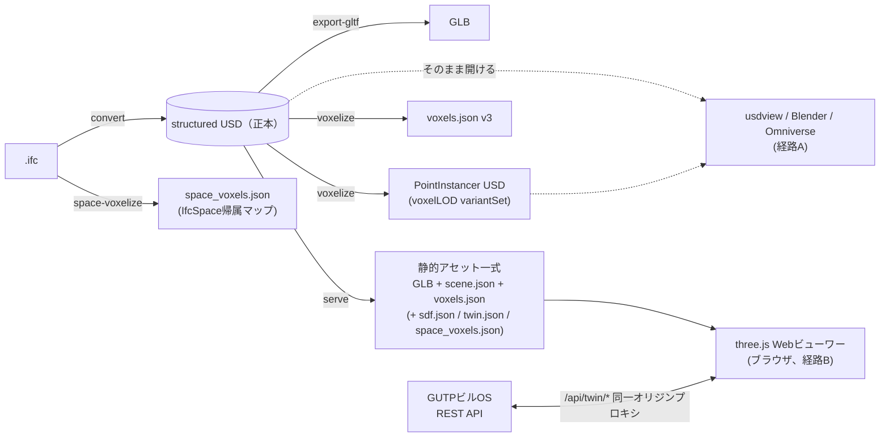

# IFC2USD

**IFC（建築BIM）モデルを構造化された [OpenUSD](https://openusd.org/) ステージへ変換し、
ボクセル解析・glTF・自己完結型Webビューワー・ビルOS連携のデジタルツイン表示まで、
ひとつのCLIで扱えるツールキット。**

IFCの空間階層（Site → Building → Storey → Space / Element → Object）をUSDのXform階層として再現し、
各エレメントにメッシュ・UsdPreviewSurfaceマテリアル・IFC由来のメタデータ
（GUID・クラス・名称・緯度経度など）を `customData` として付与する。

> 📖 システム全体の解説（概要・アーキテクチャ・機能・使い方・利用技術）は
> [`docs/overview.html`](docs/overview.html) をブラウザで開いても読める。

## 目次

- [主な機能](#主な機能)
- [クイックスタート](#クイックスタート)
- [コンセプトとアーキテクチャ](#コンセプトとアーキテクチャ)
- [CLIコマンド](#cliコマンド)
  - [`convert` — IFC→USD変換](#convert--ifcusd変換)
  - [`voxelize` — ボクセル化](#voxelize--ボクセル化)
  - [`export-gltf` — glTF(GLB)エクスポート](#export-gltf--gltfglbエクスポート)
  - [`serve` — Webビューワー](#serve--webビューワー)
  - [`space-voxelize` — 空間ボクセル化（デジタルツイン用）](#space-voxelize--空間ボクセル化デジタルツイン用)
- [デジタルツイン表示モード](#デジタルツイン表示モード)
- [テスト](#テスト)
- [リポジトリ構成](#リポジトリ構成)
- [動作要件](#動作要件)

## 主な機能

- **IFC→USD変換** — 空間階層・ジオメトリ・マテリアル・メタデータを忠実にUSDへ。
  変換結果が常に唯一の正本（single source of truth）
- **ボクセル化** — 表面/内部充填の占有ボクセルをLOD付きで生成。
  Morton(Z-order)符号化 + delta+RLE圧縮のJSONと、正本を書き換えないPointInstancer USDレイヤーの2形式
- **glTF(GLB)エクスポート** — Webビューワーの表示形式であり、単体でも利用可能
- **自己完結Webビューワー** — three.js同梱・CDN参照なし・ビルド不要。
  階層ツリー、クリック選択、プロパティパネル、表示モード/LOD切替、断面クリップ、
  SDF（符号付き距離場）水平断面オーバーレイ
- **デジタルツイン表示モード** — GUTPビルOSのREST APIと連携し、センサー計測値による
  要素の色マッピング（Live）、部屋単位のボクセルヒートマップ、時系列再生（Playback）

## クイックスタート

[uv](https://docs.astral.sh/uv/) だけで完結する（conda や USD のソースビルドは不要）。

```bash
# 依存関係のインストール（.venv を自動作成）
uv sync

# IFC→USD変換（既定で output/<name>_structured.usda を出力）
uv run ifc2usd files/ToyodaLab.ifc

# 変換結果をブラウザで閲覧
uv run ifc2usd serve output/ToyodaLab_structured.usda
# → http://127.0.0.1:8000 が開く
```

## コンセプトとアーキテクチャ

このリポジトリは大きく2つのことをする。

1. **IFC→USD変換**（`convert`）: IFCの空間階層・ジオメトリ・マテリアル・メタデータを、
   忠実にUSDへ変換する。これが正本になる。
2. **変換結果の統合閲覧**: 変換したUSDを、ボクセル化・SDF解析・軽量な配信形式へと
   派生させ、複数の閲覧手段を提供する。

閲覧手段を1つの独自ビューワーに寄せるのではなく、**Hydra（USDのレンダリング抽象化層）の
設計思想に倣い、「シーンデータの用意」と「実際のレンダリング」を分離**している
（詳細は [`docs/viewer/README.md`](docs/viewer/README.md)）。そのため実行経路は2系統ある:

- **経路A（USDネイティブ）**: `voxelize` が生成するPointInstancerレイヤーを、USDを直接読める
  既存ビューワー（usdview / Blender / NVIDIA Omniverse）でそのまま開く。独自レンダラは書かない。
- **経路B（Webビューワー、本命）**: `serve` が起動する、three.jsベースの自己完結Webビューワー。
  ネットワーク接続の無い環境でも動く（CDN参照なし、three.jsは同梱）。



設計上の不変条件:

- **`convert` が生成するUSDが常に唯一の正本。** `voxelize`/`export-gltf`/`serve` はいずれも
  この正本を読むだけで書き換えない（PointInstancerレイヤーも既存USDへの参照を持つ独立ファイル）。
- **派生アセットはすべて「付加的」。** voxels.json / sdf.json / twin.json / space_voxels.json は
  存在しなければビューワーの既存動作を一切変えない。`scene.json` の `assets.*` キーで存在を伝える。
- **WebビューワーはUSDを直接パースしない。** `serve` が組み立てるGLB + scene.json ほか軽量な
  派生ファイルだけを読む。
- **ビルOSのURL・認証情報はサーバー側にのみ存在する。** ブラウザからは同一オリジンの
  ホワイトリスト済みプロキシ（`/api/twin/values`・`/api/twin/history`）越しにしか到達できない。

## CLIコマンド

### `convert` — IFC→USD変換

```bash
uv run ifc2usd convert files/ToyodaLab.ifc -o output/model.usda --y-up --verbose
uv run ifc2usd files/ToyodaLab.ifc            # サブコマンド省略時の後方互換形
uv run python -m ifc2usd files/ToyodaLab.ifc  # モジュールとしても起動可能
```

| 引数 | 説明 |
| --- | --- |
| `ifc_path` | 入力する `.ifc` ファイル（必須） |
| `-o, --output` | 出力する `.usd` / `.usda` パス（既定: `output/<name>_structured.usda`） |
| `--y-up` | Y-UP軸で出力（既定はIFC標準のZ-UP） |
| `-v, --verbose` | 詳細ログを出力 |

### `voxelize` — ボクセル化

変換済みのUSD（推奨）またはIFCを直接、メッシュの占有ボクセルへ変換する。
複数の `--size` を指定するとLOD（詳細度）ごとのボクセルデータになる。

```bash
uv run ifc2usd voxelize output/model.usda --size 1.0 --size 0.5   # 変換済みUSDから（推奨）
uv run ifc2usd voxelize files/ToyodaLab.ifc --size 0.5            # IFCから直接
uv run ifc2usd voxelize output/model.usda --fill                  # 内部充填（既定は表面のみ）
```

出力（`-o` はベース名。既定 `output/<name>_voxels`）:

- `<base>.json` — ボクセルJSON v3（[`docs/viewer/spec.md`](docs/viewer/spec.md) §2）。
  要素(GUID)ごとにMorton符号化・delta+RLE圧縮した占有ボクセル座標と色を格納
- `<base>.usda` — PointInstancerボクセルレイヤー。正本USDを書き換えない独立ファイルで、
  `voxelLOD` variantSetで `--size` ごとのLODを切替できる
  （usdviewでの確認手順は [`docs/viewer/usdview-checklist.md`](docs/viewer/usdview-checklist.md)）

内部充填（`--fill`）はボクセルグリッド上の外部flood-fillによる判定で、
非多様体な実モデルでも安定して動く。

### `export-gltf` — glTF(GLB)エクスポート

```bash
uv run ifc2usd export-gltf output/model.usda -o output/model.glb
```

各ノードの `extras` にGUID/class/nameを書き出すため、glTF側でもIFC要素との対応が追える。

### `serve` — Webビューワー

変換済みUSDを、ブラウザで動くthree.jsベースのローカルWebビューワーとして配信する。

```bash
uv run ifc2usd serve output/model.usda
# --port 8000（既定） / --no-open でブラウザ自動起動を抑止

# 要素ごとのSDF水平スライスも生成（既定off、追加の計算コストがあるためopt-in）
uv run ifc2usd serve output/model.usda --sdf-slices

# デジタルツインモード（後述）
uv run ifc2usd serve output/model.usda --twin twin-config.json --space-voxels output/spaces.json
```

ビューワーの機能:

- 階層ツリー表示・要素ごとの表示/非表示切替・検索・アイソレート
- 3Dクリックまたはツリーからの選択（GUID/class/customDataを表示するプロパティパネル付き。
  ボクセル表示モードでも選択要素のボクセルがハイライトされる）・ホバー/アウトラインハイライト
- メッシュ/ボクセル/両方の表示モード切替とボクセルLOD切替
- 断面クリップ（高さスライダーで、その高さより上を隠す）
- `--sdf-slices` 指定時: 選択要素のnarrow-band SDF水平断面を半透明オーバーレイ表示
  （白=表面、青=内部、橙=外部）
- `--twin` 指定時: Live色マッピング・凡例・Live Dataパネル・空間ヒートマップ・時系列再生
  （[デジタルツイン表示モード](#デジタルツイン表示モード)参照）

サーバーは `127.0.0.1` のみにバインドし、ディレクトリリスティングは無効。

### `space-voxelize` — 空間ボクセル化（デジタルツイン用）

`IfcSpace`（部屋）ジオメトリをボクセル化し、「どのボクセルがどの部屋に属するか」の
帰属マップを生成する。部屋単位ヒートマップ（E9-5）の前提データで、正本USDには
IfcSpaceが含まれないため、元の `.ifc` と変換済みUSD（`--reference`、原点合わせ用）の
両方を渡す。

```bash
uv run ifc2usd space-voxelize files/ToyodaLab.ifc \
    --reference output/model.usda --size 0.5 -o output/spaces.json
```

隣接する部屋の境界セルは体積の小さい空間へ決定的に帰属させるため、
同じ入力からは常に同じ出力が得られる。

## デジタルツイン表示モード

GUTPビルOSのREST APIと連携し、実際のセンサー計測値を3Dモデル上へ可視化する
（仕様は [`docs/viewer/digital-twin-spec.md`](docs/viewer/digital-twin-spec.md)）。

```bash
uv run ifc2usd serve output/model.usda --twin twin-config.json --space-voxels output/spaces.json
```

- **Live** — メトリック（温度・CO2など）を選び、`/api/twin/values` のポーリングで
  バインド済み要素をturboカラーマップで着色。ポーリング間隔×3より古い値は彩度を落として
  「止まっているのに動いて見える」事故を防ぐ
- **空間ヒートマップ** — `--space-voxels` 指定時、部屋単位の集計値（平均）でボクセルを着色。
  IfcSpaceジオメトリが無いモデルではStorey配下の要素メッシュ着色へフォールバック
- **Playback** — `/api/twin/history` を一括取得してフレーム列へ整形し、スライダー/自動再生で
  過去の値をスクラブ。再生中の逐次fetchはしない。色計算はLiveと完全に同一の関数を通る
- **GUID↔ポイントのマッピング** — ビルOSのデータモデルはIFC GUIDを持たないため、
  `mapping.json` が結合層になる。手動記述・IFCプロパティからの自動生成・ビルOS `customTags`
  逆引きの3経路を `ifc2usd/mapping.py` が提供する
- **セキュリティ** — ビルOSのURL・認証情報は `twin-config.json`（サーバー側）にのみ存在。
  ブラウザへ配信される `twin.json` はメトリック定義とバインディングのみで、プロキシの
  エラー応答も上流URLを含まない

## テスト

小さな合成フィクスチャ（Site/Building/Storeyに色付きの壁2枚）を変換し、座標系・階層・
ジオメトリ・マテリアル・ボクセル化・glTFエクスポート・ビューワー・デジタルツイン連携を
検証するテストを同梱している。外部データ不要で動き、Webビューワー関連はPlaywright
（`uv sync` のdevグループで導入済み）による実ブラウザE2Eテスト
（レンダリング画素の実サンプリングまで行う）。ビルOSはモックHTTPサーバーで代替する。

```bash
uv run pytest                              # 全テストの実行
uv run python tests/generate_fixture.py    # tests/fixtures/minimal.ifc の再生成
```

## リポジトリ構成

```
ifc2usd/                 本体パッケージ / CLI
├── cli.py               CLIエントリポイント（convert / voxelize / export-gltf / serve / space-voxelize）
├── ifc.py               IFCジオメトリ・プロパティ抽出（ifcopenshell 0.8）、IfcSpace抽出
├── usd.py               USDステージ構築、変換済みUSDからの要素抽出
├── voxel.py             占有ボクセル化・Morton符号化・JSON/PointInstancerレイヤー出力
├── sdf.py               narrow-band SDF（符号付き距離場）構築
├── sdf_slice.py         SDFの水平断面グリッド化（ビューワーオーバーレイ用）
├── gltf.py              USD→glTF(GLB)エクスポート
├── scene_index.py       USD→scene.json（ビューワー用の階層・customData抽出）
├── serve.py             静的アセット組み立て + ローカルHTTPサーバー + twinプロキシ
├── twin.py              GUTPビルOS REST APIアダプタ + twin.jsonスキーマ
├── mapping.py           GUID↔ポイントのmapping.json（検証 + 3生成経路）
├── twin_proxy.py        メトリック単位TTLキャッシュ付き同一オリジンプロキシ
├── space_heatmap.py     IfcSpaceボクセル帰属マップ + 空間/Storey単位の値集計
└── viewer/              three.js Webビューワー（ビルド不要、three.js同梱）

docs/
├── overview.html        本システムの解説ページ（ブラウザで直接開ける）
└── viewer/              調査・アーキテクチャ・仕様・バックログ・デジタルツイン仕様

tests/                   pytest + Playwright E2E（モックビルOS含む）
files/                   サンプルIFCモデル
IFC_to_USD.ipynb         変換ロジックのもとになったノートブック（参照用に保持）
```

`IFC_to_GLTF.ipynb` / `IFC_to_RDF.ipynb` / `GLTF_to_Voxel.ipynb` は関連する別系統の
ノートブックパイプラインで、本パッケージの対象外。

## 動作要件

`pyproject.toml` に定義（`uv sync` で解決）:

- Python >= 3.10
- [usd-core](https://pypi.org/project/usd-core/) >= 25.5（OpenUSD）
- [ifcopenshell](https://pypi.org/project/ifcopenshell/) >= 0.8
- [numpy](https://numpy.org/) / [tqdm](https://tqdm.github.io/)
- [trimesh](https://trimesh.org/)（glTFエクスポート）
- [rtree](https://pypi.org/project/rtree/)（ボクセル化の空間判定）
- 開発用: pytest / [Playwright](https://playwright.dev/python/)（ブラウザE2E）

生成されたUSDは usdview（[OpenUSDツール](https://openusd.org/release/toolset.html)）・
Blender（USDインポート）・NVIDIA Omniverse でそのまま開ける。シーン単位はメートル
（`metersPerUnit = 1.0`）。
