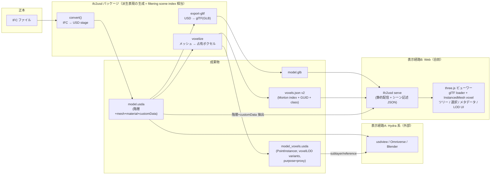

# アーキテクチャ: USD / ボクセル統合ビューワー

## 1. 設計原則（Hydra からの借用）

Hydra の核心は次の 3 点であり、本設計はこれをリポジトリの規模に合わせて写像する。

| Hydra の概念 | 本設計での対応物 |
| --- | --- |
| シーンの正本（USD stage / `UsdImagingStageSceneIndex`） | `ifc2usd` が生成する USD ステージ（意味情報 = customData を含む唯一の正本） |
| filtering scene index（合成可能なシーン変換の連鎖） | 派生表現ジェネレータ: `voxelize`（占有ボクセル）、`export-gltf`（表示用メッシュ）、将来の `sdf` / `tile` |
| render delegate（差し替え可能な描画先） | 表示経路: A) Hydra 系ビューワー（usdview / Omniverse / Blender）、B) 自前 Web ビューワー（three.js） |
| variantSet / purpose / payload | LOD 切替（voxelLOD variant）、メッシュ⇔ボクセル切替（purpose）、遅延ロード（payload） |

**独自 render delegate は実装しない。** 代わりに (a) Hydra 系ビューワーが正しく表示できる
USD をオーサリングし、(b) Web には glTF + ボクセル JSON という「Web の事実上標準」で届ける。

## 2. 全体構成



### データフローの要点

1. **正本は USD ステージ 1 つ。** ボクセルも glTF も、GUID をキーに正本へ逆参照できる
   派生表現として生成する（現行ノートブックの「glTF 経由で座標系が独立」という問題を解消）。
2. **ボクセルは 2 形式で出力する。**
   - `model_voxels.usda`: `UsdGeomPointInstancer`。Hydra 系ビューワー向け。
     LOD は variantSet、`purpose=proxy` でメッシュと共存。正本ステージに reference/sublayer
     で合成する（Hydra の合成可能性をそのまま利用）。
   - `voxels.json` (v2): Web ビューワーと解析（Morton/Z-order による空間索引）向け。
     ノートブック形式の後継として仕様化する（spec.md 参照）。
3. **Web ビューワーは「シーン記述 JSON」を入口にする。** `ifc2usd serve` が
   USD から階層ツリーと customData を抽出した `scene.json` を生成し、GLB・voxels.json への
   参照を束ねる。ビューワー本体は USD を直接パースしない（usd-wasm の成熟を待って
   差し替え可能な位置に置く — ここも delegate 的な分離）。

## 3. 表示経路の役割分担

| | 経路A: Hydra 系 | 経路B: Web |
| --- | --- | --- |
| 対象ユーザー | 開発者・DCC ユーザー | 施主・現場・ブラウザのみの環境 |
| 実装コスト | 低（オーサリングのみ） | 中（JS 実装が必要） |
| ボクセル | PointInstancer（数十万個まで実用） | InstancedMesh（同等の手法） |
| 意味情報 | usdview の prim ブラウザで customData 閲覧 | ツリー + プロパティパネルを自前実装 |
| ボリューム場（将来） | UsdVol + OpenVDB を Storm/RTX が描画 | レイマーチ実装が必要（後期） |
| 検証での位置づけ | 先行実装・回帰テストの目視確認 | プロダクトとしての本命 |

## 4. モジュール構成（実装時）

```
ifc2usd/
  cli.py          # サブコマンド化: convert / voxelize / export-gltf / serve
  ifc.py          # 既存
  usd.py          # 既存
  voxel.py        # 新規: メッシュ→占有ボクセル(numpy)、Morton 符号化、JSON v2 / PointInstancer 書き出し
  gltf.py         # 新規: USD → GLB（trimesh 利用。IFC_to_GLTF.ipynb の知見を移植）
  scene_index.py  # 新規: USD → scene.json（階層 + customData + 参照の抽出）
  viewer/         # 新規: 静的 Web アセット（three.js は vendoring、ビルドステップなし）
    index.html
    viewer.js
    three.module.js (vendored)
tests/
  test_voxelize.py, test_scene_index.py  # フィクスチャで E2E
```

- 座標系: ビューワー内部は Z-UP のまま扱い、three.js には `scene.up` / ルート回転で吸収
  （`--y-up` 変換は既存 CLI の責務のまま）。
- 依存追加は `trimesh`（ボクセル化・GLB 書き出し）のみに抑える。`pymorton` は純 Python の
  小関数なので `voxel.py` 内に実装して依存を増やさない（.gitignore に pymorton.py の
  名残があり、過去も同判断だった形跡がある）。
- サーバは `http.server` ベースの薄い実装から始める（FastAPI 等は時系列連携フェーズで検討）。

## 5. 将来拡張との接続（空間解析カーネル調査との整合）

- **フィールド層**: `voxel.py` の占有グリッドを TSDF/SDF に拡張し、`UsdVol.OpenVDBAsset`
  で参照する（OpenVDB 導入はこの時点で検討）。
- **配信層**: 建物 1 棟規模を超えたら glTF 一括ロードを 3D Tiles（implicit tiling）に
  置換。Morton 符号化済みのボクセル索引はサブツリー分割にそのまま流用できる。
- **意味層**: scene.json の customData を Brick/BOT へのリンクに拡張すれば、
  センサー時系列の `aggregate_by_space` 系 API の表示面になる。
- いずれも「派生表現ジェネレータを追加し、表示経路は据え置く」形で吸収できるのが
  本アーキテクチャの狙い。
