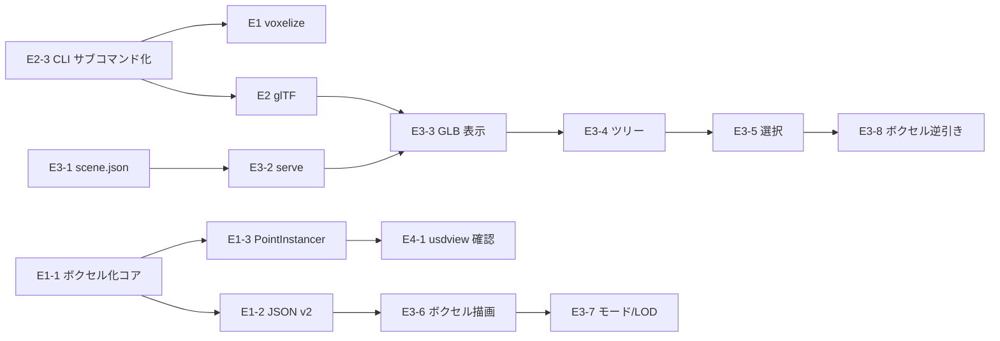

# バックログ: USD / ボクセル統合ビューワー

優先度: P0 = MVP 必須 / P1 = MVP 直後 / P2 = 将来。
規模: S(〜1日) / M(2〜4日) / L(1〜2週)。ID は Epic-Story 形式。

## Epic E1: ボクセル化のパッケージ取り込み（P0）

ノートブック（GLTF_to_Voxel.ipynb）のボクセル化を `ifc2usd` に移植し、
USD と座標整合した 2 形式（JSON v2 / PointInstancer）を出力する。

| ID | ストーリー | 優先度 | 規模 | 受け入れ条件 |
| --- | --- | --- | --- | --- |
| E1-1 | `voxel.py`: メッシュ→表面占有ボクセル化（numpy/trimesh）＋ Morton 符号化（自前実装） | P0 | M | フィクスチャの壁 2 枚が正しい格子数・位置でボクセル化される（pytest） |
| E1-2 | ボクセル JSON v2 ライター（spec §2） | P0 | S | スキーマ準拠・`origin + index*size` が USD ワールド AABB と一致 |
| E1-3 | PointInstancer レイヤーライター（spec §3: reference / variantSet voxelLOD / purpose=proxy / GUID 逆引き customData） | P0 | M | usd-core で Stage.Open でき、variant 切替で positions が入れ替わる（pytest） |
| E1-4 | `ifc2usd voxelize` サブコマンド（複数 `--size`、`--fill` オプション） | P0 | S | CLI E2E が pytest で通る |
| E1-5 | v1 JSON（ノートブック形式）→ v2 変換ローダー | P1 | S | 既存 IfcOpenHouse.json が v2 に変換できる |
| E1-6 | ドキュメント更新（README / CLAUDE.md にボクセルの節を追加） | P0 | S | コマンド例と出力例が記載されている |

## Epic E2: glTF エクスポートのパッケージ取り込み（P0）

| ID | ストーリー | 優先度 | 規模 | 受け入れ条件 |
| --- | --- | --- | --- | --- |
| E2-1 | `gltf.py`: USD ステージ→GLB（trimesh）。ノード `extras.guid` 付与、displayColor/PBR 反映 | P0 | M | フィクスチャ GLB の色・階層・guid extras を pytest で検証 |
| E2-2 | `ifc2usd export-gltf` サブコマンド | P0 | S | CLI E2E が通る |
| E2-3 | CLI のサブコマンド化リファクタ（`convert` 後方互換維持） | P0 | S | `ifc2usd <ifc>` が従来どおり動く回帰テスト |

## Epic E3: Web ビューワー MVP（P0〜P1）

| ID | ストーリー | 優先度 | 規模 | 受け入れ条件 |
| --- | --- | --- | --- | --- |
| E3-1 | `scene_index.py`: USD→scene.json（階層 + customData 抽出） | P0 | S | フィクスチャで tree/guid を pytest 検証 |
| E3-2 | `ifc2usd serve`: 静的配信（http.server ベース、CDN 非依存、three.js vendoring） | P0 | S | オフラインで起動しビューワーが表示される |
| E3-3 | GLB 表示 + カメラ操作 + Z-UP 吸収（FR-1, FR-9） | P0 | M | ToyodaLab が 3 秒以内に表示（NFR-1） |
| E3-4 | 階層ツリー + 表示切替 + 選択同期（FR-2, FR-4） | P0 | M | Playwright でツリー選択→ハイライトを検証 |
| E3-5 | クリック選択 + プロパティパネル（FR-3） | P0 | M | GUID/class/customData が表示される |
| E3-6 | ボクセル描画: voxels.json v2 → InstancedMesh（FR-5） | P0 | M | 要素色つきボクセルが表示・50 万個で操作可能（NFR-2） |
| E3-7 | メッシュ/ボクセル表示モード + LOD 切替（FR-6, FR-7） | P1 | S | UI 切替が機能する |
| E3-8 | ボクセル→GUID 逆引き選択（FR-8） | P1 | M | ボクセルクリックで正しい要素情報が出る |
| E3-9 | 断面クリップ平面（FR-10） | P1 | S | Z スライダーで階別確認ができる |
| E3-10 | Playwright による UI 回帰テスト整備（NFR-5 拡張） | P1 | M | CI 相当のスクリプトで FR-1〜8 が自動検証される |

## Epic E4: Hydra 系ビューワー対応の仕上げ（P1）

| ID | ストーリー | 優先度 | 規模 | 受け入れ条件 |
| --- | --- | --- | --- | --- |
| E4-1 | usdview（prebuilt バイナリ）での動作確認手順書（voxelLOD variant / purpose 切替） | P1 | S | docs にチェックリストがあり、スクリーンショット付き |
| E4-2 | Blender / Omniverse での読み込み確認と既知の差異の記録 | P2 | S | 差異が docs に記録されている |
| E4-3 | payload 化による大規模モデルの遅延ロード検証 | P2 | M | 大型 IFC で初期表示が短縮される計測結果 |

## Epic E5: ボリューム場と解析表示（P2 / 将来）

空間解析カーネル調査の field layer に接続するフェーズ。

| ID | ストーリー | 優先度 | 規模 | 受け入れ条件 |
| --- | --- | --- | --- | --- |
| E5-1 | 占有グリッド→SDF（narrow-band）生成 | P2 | L | clearance クエリが返せる |
| E5-2 | UsdVol + OpenVDBAsset 出力（温熱・CO₂ 等の連続場） | P2 | L | usdview/Omniverse でボリュームが表示される |
| E5-3 | Web レイマーチ表示（WebGL/WebGPU） | P2 | L | 場の等値面/スライスが表示される |
| E5-4 | センサー時系列の空間集計表示（aggregate_by_space の表示面） | P2 | L | 部屋別ヒートマップが表示される |

E5-1は実装済み（`ifc2usd/sdf.py`、Issue #27）。E5-3はスコープを縮小して実装済み
（`ifc2usd/sdf_slice.py` + `serve --sdf-slices`、Issue #29）: 要素ごとのnarrow-band SDF
水平スライスをWebビューワーへオーバーレイ表示する「スライス」側のみを満たし、
GPUボリュームレイマーチ（3Dテクスチャ+フラグメントシェーダーのレイステップ）は
見送った。E5-2（UsdVol + OpenVDBAsset出力）は、実データを持つ`.vdb`ファイルを
オーサリングできるOpenVDBのPython実装（`openvdb`/`pyopenvdb`）がこの環境ではpipで
配布されておらず未着手（`pxr.UsdVol.OpenVDBAsset`スキーマ自体は`usd-core`に含まれ
利用できることは確認済みだが、参照先の`.vdb`データを作る手段が無い）。E5-3のGPU
レイマーチ実装も、ボリュームテクスチャの自然な供給元がE5-2のOpenVDB出力であるため
同じ制約を受け、あわせて見送っている。将来これらに着手する場合は、
`docs/viewer/payload-lazy-load-findings.md`と同様、この制約の再検証（OpenVDBの
配布状況が変わっていないか）から始めるとよい。

## Epic E6: 配信スケール（P2 / 将来）

| ID | ストーリー | 優先度 | 規模 | 受け入れ条件 |
| --- | --- | --- | --- | --- |
| E6-1 | glTF 一括ロード → 3D Tiles（implicit tiling）への移行検討・PoC | P2 | L | 複数棟データでストリーミング表示 |
| E6-2 | Morton ボクセル索引のサブツリー分割流用 | P2 | M | タイル境界とボクセル索引の整合検証 |
| E6-3 | usd-wasm / WebGPU Hydra delegate の再評価（年次） | P2 | S | 評価メモの更新 |

E6-3は初回評価を実施済み（`docs/viewer/usd-wasm-webgpu-findings.md`、Issue #33、2026-07）。
結論は「引き続き独自Hydraデリゲートは書かない」で変更なし。次回評価予定日は2027-07。
E6-1（3D Tiles PoC）はクライアント側の新規重量級依存（3D Tilesレンダラー等）を要する
ため、E6-2（同PoCに依存）ともども未着手。

## Epic E7: ボクセル化・描画の改善（品質向上）

ユーザーからの「ボクセル化の記述・描画上の工夫と改善余地」という問いかけを受けた
コードレビューで発見した、既存実装（Epic E1/E3）の具体的な改善項目。新機能ではなく
既存機能の正確性・性能・UXの底上げが目的。

| ID | ストーリー | 優先度 | 規模 | 受け入れ条件 |
| --- | --- | --- | --- | --- |
| E7-1 | `_surface_voxels`のnumpyベクトル化（三角形ごとのPythonループ解消） | P2 | M | 既存の全ボクセル化テストが同じ結果を維持しつつ、大規模メッシュでの実行時間が有意に改善する |
| E7-2 | `fill=True`内部充填判定の非watertightメッシュへの頑健化 | P1 | L | 非watertightな実データ（`files/ToyodaLab.ifc`）で内部充填が現状より正確に判定される、または不正確さの原因・限界がテストで明示される |
| E7-3 | ボクセルInstancedMeshの選択時個別ハイライト | P1 | S | ボクセル専用表示モードで要素を選択すると、対応するボクセルインスタンスの色が変化して選択状態が視覚的にわかる（E2E） |
| E7-4 | Mortonインデックス配列の圧縮（voxels.json） | P2 | M | 大規模モデルでJSON出力サイズが有意に削減され、ビューワー側の復元結果は既存と同一 |

E7で「動的LOD/空間分割ストリーミング」は独立ストーリー化しない——既存のE6-1（3D Tiles PoC）
／E6-2（Mortonサブツリー分割流用）が同じ課題をすでに追跡しているため、重複登録を避け
そちらを参照する。

## 実施順序（依存関係）

推奨スプリント割り（1 スプリント = 1 週間目安）:

1. **Sprint 1**: E2-3, E1-1, E1-2, E1-4（ボクセル化と CLI 基盤）
2. **Sprint 2**: E1-3, E2-1, E2-2, E3-1（PointInstancer / glTF / scene.json）
3. **Sprint 3**: E3-2, E3-3, E3-4, E3-5（Web ビューワー表示・選択）
4. **Sprint 4**: E3-6, E3-7, E3-8, E1-6, E4-1（ボクセル統合と仕上げ）
5. 以降: E3-9, E3-10, E4-2 → P2 エピックは需要に応じて着手
