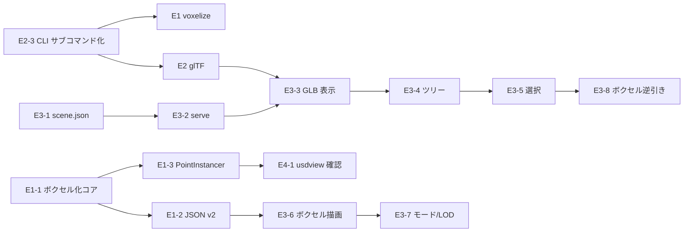

# バックログ: USD / ボクセル統合ビューワー

優先度: P0 = MVP 必須 / P1 = MVP 直後 / P2 = 将来。
規模: S(〜1日) / M(2〜4日) / L(1〜2週)。ID は Epic-Story 形式。

## Epic E1: ボクセル化のパッケージ取り込み（P0）

ノートブック（GLTF_to_Voxel.ipynb）のボクセル化を `ifc2usd` に移植し、
USD と座標整合した 2 形式（JSON v2 / PointInstancer）を出力する。

| ID | ストーリー | 優先度 | 規模 | 受け入れ条件 |
| --- | --- | --- | --- | --- |
| E1-1 | `voxel.py`: メッシュ→表面占有ボクセル化（numpy/trimesh）＋ Morton 符号化（自前実装） | P0 | M | フィクスチャの壁 2 枚が正しい格子数・位置でボクセル化される（pytest） |
| E1-2 | ボクセル JSON v2 ライター（spec §2） | P0 | S | スキーマ準拠・`origin + index*size` が USD ワールド AABB と一致 |
| E1-3 | PointInstancer レイヤーライター（spec §3: reference / variantSet voxelLOD / purpose=proxy / GUID 逆引き customData） | P0 | M | usd-core で Stage.Open でき、variant 切替で positions が入れ替わる（pytest） |
| E1-4 | `ifc2usd voxelize` サブコマンド（複数 `--size`、`--fill` オプション） | P0 | S | CLI E2E が pytest で通る |
| E1-5 | v1 JSON（ノートブック形式）→ v2 変換ローダー | P1 | S | 既存 IfcOpenHouse.json が v2 に変換できる |
| E1-6 | ドキュメント更新（README / CLAUDE.md にボクセルの節を追加） | P0 | S | コマンド例と出力例が記載されている |

## Epic E2: glTF エクスポートのパッケージ取り込み（P0）

| ID | ストーリー | 優先度 | 規模 | 受け入れ条件 |
| --- | --- | --- | --- | --- |
| E2-1 | `gltf.py`: USD ステージ→GLB（trimesh）。ノード `extras.guid` 付与、displayColor/PBR 反映 | P0 | M | フィクスチャ GLB の色・階層・guid extras を pytest で検証 |
| E2-2 | `ifc2usd export-gltf` サブコマンド | P0 | S | CLI E2E が通る |
| E2-3 | CLI のサブコマンド化リファクタ（`convert` 後方互換維持） | P0 | S | `ifc2usd <ifc>` が従来どおり動く回帰テスト |

## Epic E3: Web ビューワー MVP（P0〜P1）

| ID | ストーリー | 優先度 | 規模 | 受け入れ条件 |
| --- | --- | --- | --- | --- |
| E3-1 | `scene_index.py`: USD→scene.json（階層 + customData 抽出） | P0 | S | フィクスチャで tree/guid を pytest 検証 |
| E3-2 | `ifc2usd serve`: 静的配信（http.server ベース、CDN 非依存、three.js vendoring） | P0 | S | オフラインで起動しビューワーが表示される |
| E3-3 | GLB 表示 + カメラ操作 + Z-UP 吸収（FR-1, FR-9） | P0 | M | ToyodaLab が 3 秒以内に表示（NFR-1） |
| E3-4 | 階層ツリー + 表示切替 + 選択同期（FR-2, FR-4） | P0 | M | Playwright でツリー選択→ハイライトを検証 |
| E3-5 | クリック選択 + プロパティパネル（FR-3） | P0 | M | GUID/class/customData が表示される |
| E3-6 | ボクセル描画: voxels.json v2 → InstancedMesh（FR-5） | P0 | M | 要素色つきボクセルが表示・50 万個で操作可能（NFR-2） |
| E3-7 | メッシュ/ボクセル表示モード + LOD 切替（FR-6, FR-7） | P1 | S | UI 切替が機能する |
| E3-8 | ボクセル→GUID 逆引き選択（FR-8） | P1 | M | ボクセルクリックで正しい要素情報が出る |
| E3-9 | 断面クリップ平面（FR-10） | P1 | S | Z スライダーで階別確認ができる |
| E3-10 | Playwright による UI 回帰テスト整備（NFR-5 拡張） | P1 | M | CI 相当のスクリプトで FR-1〜8 が自動検証される |

## Epic E4: Hydra 系ビューワー対応の仕上げ（P1）

| ID | ストーリー | 優先度 | 規模 | 受け入れ条件 |
| --- | --- | --- | --- | --- |
| E4-1 | usdview（prebuilt バイナリ）での動作確認手順書（voxelLOD variant / purpose 切替） | P1 | S | docs にチェックリストがあり、スクリーンショット付き |
| E4-2 | Blender / Omniverse での読み込み確認と既知の差異の記録 | P2 | S | 差異が docs に記録されている |
| E4-3 | payload 化による大規模モデルの遅延ロード検証 | P2 | M | 大型 IFC で初期表示が短縮される計測結果 |

## Epic E5: ボリューム場と解析表示（P2 / 将来）

空間解析カーネル調査の field layer に接続するフェーズ。

| ID | ストーリー | 優先度 | 規模 | 受け入れ条件 |
| --- | --- | --- | --- | --- |
| E5-1 | 占有グリッド→SDF（narrow-band）生成 | P2 | L | clearance クエリが返せる |
| E5-2 | UsdVol + OpenVDBAsset 出力（温熱・CO₂ 等の連続場） | P2 | L | usdview/Omniverse でボリュームが表示される |
| E5-3 | Web レイマーチ表示（WebGL/WebGPU） | P2 | L | 場の等値面/スライスが表示される |
| E5-4 | センサー時系列の空間集計表示（aggregate_by_space の表示面） | P2 | L | 部屋別ヒートマップが表示される |

E5-1は実装済み（`ifc2usd/sdf.py`、Issue #27）。E5-3はスコープを縮小して実装済み
（`ifc2usd/sdf_slice.py` + `serve --sdf-slices`、Issue #29）: 要素ごとのnarrow-band SDF
水平スライスをWebビューワーへオーバーレイ表示する「スライス」側のみを満たし、
GPUボリュームレイマーチ（3Dテクスチャ+フラグメントシェーダーのレイステップ）は
見送った。E5-2（UsdVol + OpenVDBAsset出力）は、実データを持つ`.vdb`ファイルを
オーサリングできるOpenVDBのPython実装（`openvdb`/`pyopenvdb`）がこの環境ではpipで
配布されておらず未着手（`pxr.UsdVol.OpenVDBAsset`スキーマ自体は`usd-core`に含まれ
利用できることは確認済みだが、参照先の`.vdb`データを作る手段が無い）。E5-3のGPU
レイマーチ実装も、ボリュームテクスチャの自然な供給元がE5-2のOpenVDB出力であるため
同じ制約を受け、あわせて見送っている。将来これらに着手する場合は、
`docs/viewer/payload-lazy-load-findings.md`と同様、この制約の再検証（OpenVDBの
配布状況が変わっていないか）から始めるとよい。

## Epic E6: 配信スケール（P2 / 将来）

| ID | ストーリー | 優先度 | 規模 | 受け入れ条件 |
| --- | --- | --- | --- | --- |
| E6-1 | glTF 一括ロード → 3D Tiles（implicit tiling）への移行検討・PoC | P2 | L | 複数棟データでストリーミング表示 |
| E6-2 | Morton ボクセル索引のサブツリー分割流用 | P2 | M | タイル境界とボクセル索引の整合検証 |
| E6-3 | usd-wasm / WebGPU Hydra delegate の再評価（年次） | P2 | S | 評価メモの更新 |

E6-3は初回評価を実施済み（`docs/viewer/usd-wasm-webgpu-findings.md`、Issue #33、2026-07）。
結論は「引き続き独自Hydraデリゲートは書かない」で変更なし。次回評価予定日は2027-07。
E6-1（3D Tiles PoC）はクライアント側の新規重量級依存（3D Tilesレンダラー等）を要する
ため、E6-2（同PoCに依存）ともども未着手。

## Epic E7: ボクセル化・描画の改善（品質向上）

ユーザーからの「ボクセル化の記述・描画上の工夫と改善余地」という問いかけを受けた
コードレビューで発見した、既存実装（Epic E1/E3）の具体的な改善項目。新機能ではなく
既存機能の正確性・性能・UXの底上げが目的。

| ID | ストーリー | 優先度 | 規模 | 受け入れ条件 |
| --- | --- | --- | --- | --- |
| E7-1 | `_surface_voxels`のnumpyベクトル化（三角形ごとのPythonループ解消） | P2 | M | 既存の全ボクセル化テストが同じ結果を維持しつつ、大規模メッシュでの実行時間が有意に改善する |
| E7-2 | `fill=True`内部充填判定の非watertightメッシュへの頑健化 | P1 | L | 非watertightな実データ（`files/ToyodaLab.ifc`）で内部充填が現状より正確に判定される、または不正確さの原因・限界がテストで明示される |
| E7-3 | ボクセルInstancedMeshの選択時個別ハイライト | P1 | S | ボクセル専用表示モードで要素を選択すると、対応するボクセルインスタンスの色が変化して選択状態が視覚的にわかる（E2E） |
| E7-4 | Mortonインデックス配列の圧縮（voxels.json） | P2 | M | 大規模モデルでJSON出力サイズが有意に削減され、ビューワー側の復元結果は既存と同一 |

E7で「動的LOD/空間分割ストリーミング」は独立ストーリー化しない——既存のE6-1（3D Tiles PoC）
／E6-2（Mortonサブツリー分割流用）が同じ課題をすでに追跡しているため、重複登録を避け
そちらを参照する。

E7-1（ベクトル化）・E7-2（fill=True内部充填の非watertightメッシュ頑健化、Issue #36）・
E7-3（ボクセル選択ハイライト）・E7-4（Mortonインデックス配列の圧縮、Issue #38）は
実装済み。ワイヤフレーム表示トグルもE7外の単発改善として実装済み。E7-3の作業中に
発見されたボクセル描画がほぼ真っ黒になる既存バグはIssue #39として登録され、
Epic E8のE8-6が引き取る。

## Epic E8: ビューワーUX・デザイン改良（P1）

仕様は `docs/viewer/ux-spec.md`。機能追加ではなく「既にある機能を、綺麗に・気持ちよく・
迷わず使える」ようにする品質エピック。ビルド不要（ES modules + vendored three.js）の
構成とPlaywrightテスト可能性を維持したまま行う。

| ID | ストーリー | 優先度 | 規模 | 受け入れ条件 |
| --- | --- | --- | --- | --- |
| E8-6 | ボクセル描画品質の修復（Issue #39） | P1 | M | ボクセル専用表示モードで要素色が視認できる輝度で描画される（画素検証E2E）。E8-1/E9系の前提のため**Epic内で最初に着手** |
| E8-1 | 選択ハイライト強化: バックフェイス方式アウトライン + ゴースト表示 + ダブルクリックフィット | P1 | M | 選択要素に輪郭が付き（メッシュ/ボクセル両方、画素検証）、ゴーストON時に非選択要素が半透明になる。共有マテリアルへの波及が無い |
| E8-2 | ホバー連携: 3D⇔ツリー双方向のホバーハイライト | P1 | S | 3Dホバーで対象が予告表示され、ツリー行にも`.hovered`が付く（逆方向も）。1フレーム1レイキャスト以内 |
| E8-3 | ツリー改良: 折りたたみ・選択行の自動展開+スクロール・検索・色チップ・isolate | P1 | M | 3D選択でツリーが該当行まで自動展開+スクロールする。検索でマッチ行+祖先のみ表示。`scene.json`ノードに`color`を追加（後方互換） |
| E8-4 | プロパティパネル改良: 整形表示・GUIDコピー・未選択時ガイド | P2 | S | キーが定義順・整形済みで表示され、GUIDがワンクリックでコピーできる |
| E8-5 | ツールバーのグループ化・CSSデザイントークン・パネル開閉・キーボードショートカット | P2 | M | コントロールがグループ化され、色/余白が`:root`のCSS変数に集約される。`F`/`Esc`/`W`/`1-3`が機能する |

## Epic E9: ビルOS連携デジタルツイン表示（P2）

仕様は `docs/viewer/digital-twin-spec.md`。GUTPビルOS（gutp-building-os-ri）等の
建物データプラットフォームからセンサ・設備の実測値を取得し、GUID/空間でBIM要素・
ボクセルへマッピングして表示する「ツインモード」をWebビューワーへ追加する。
E5-4（センサー時系列の空間集計表示、Issue #30）はこのEpicのE9-5が実現する。

| ID | ストーリー | 優先度 | 規模 | 受け入れ条件 |
| --- | --- | --- | --- | --- |
| E9-1 | ビルOS API接続PoC（読み取りのみ）とアダプタ層の設計確定 | P2 | M | 実際のビルOSインスタンス（またはモック）からポイント一覧と最新値が取得でき、`twin.json`スキーマが確定する |
| E9-2 | マッピング層: ポイント⇔GUID/空間の対応表（`mapping.json`）の仕様とジェネレータ | P2 | M | IFCプロパティ由来・手動記述・座標由来の3経路でマッピングが生成でき、未マッピング点が警告として列挙される |
| E9-3 | serve拡張: `--twin`モード（プロキシエンドポイント + 静的ツインアセット） | P2 | M | ビューワーが同一オリジンの`/api/twin/*`経由で最新値を取得できる（トークンはサーバー側に留まる） |
| E9-4 | オブジェクト表示: 計測値の色マッピング + 凡例 + プロパティパネルのLive Dataセクション | P2 | M | 選択要素の最新値・単位・取得時刻が表示され、メトリック選択で要素が値に応じた色になる（カラーマップ+凡例、stale表示） |
| E9-5 | 空間/ボクセルヒートマップ（部屋別集計、E5-4の実現） | P2 | L | 空間単位の集計値がボクセル色として表示される（部屋別ヒートマップ）。Issue #30をクローズできる |
| E9-6 | 時系列再生: 期間指定+タイムスライダーによる過去データのプレイバック | P2 | L | 指定期間の値の変化がスライダー操作で再生できる |

## 実施順序（依存関係）

```mermaid
flowchart LR
    E2_3[E2-3 CLI サブコマンド化] --> E1_4[E1 voxelize]
    E2_3 --> E2_1[E2 glTF]
    E1_1[E1-1 ボクセル化コア] --> E1_2[E1-2 JSON v2] --> E3_6[E3-6 ボクセル描画]
    E1_1 --> E1_3[E1-3 PointInstancer] --> E4_1[E4-1 usdview 確認]
    E2_1 --> E3_3[E3-3 GLB 表示]
    E3_1[E3-1 scene.json] --> E3_2[E3-2 serve] --> E3_3
    E3_3 --> E3_4[E3-4 ツリー] --> E3_5[E3-5 選択] --> E3_8[E3-8 ボクセル逆引き]
    E3_6 --> E3_7[E3-7 モード/LOD]
```

推奨スプリント割り（1 スプリント = 1 週間目安）:

1. **Sprint 1**: E2-3, E1-1, E1-2, E1-4（ボクセル化と CLI 基盤）
2. **Sprint 2**: E1-3, E2-1, E2-2, E3-1（PointInstancer / glTF / scene.json）
3. **Sprint 3**: E3-2, E3-3, E3-4, E3-5（Web ビューワー表示・選択）
4. **Sprint 4**: E3-6, E3-7, E3-8, E1-6, E4-1（ボクセル統合と仕上げ）
5. 以降: E3-9, E3-10, E4-2 → P2 エピックは需要に応じて着手

## Epic E11: 大規模フェデレーションモデルの性能・配信最適化

`files/kawasaki-model.ifc`（IFC2X3、192 MB、3 Site / 3 Building / 21 Storey、
7,267メッシュ）を E10 実装後に変換・表示して得た実測に基づくフォローアップ。
要件・品質ゲート・TDD/PRワークフローは `docs/viewer/e11-prd.md`、詳細な計測値と
キャプチャは `output/report/index.html` にある。

### 実測ベースライン（2026-08-26）

| 観点 | 実測値 | ボトルネック / 所見 |
| --- | ---: | --- |
| IFC → USD変換 | 498秒 | E10-6の残課題（IfcOpenShell形状生成・ピークメモリ） |
| ASCII USD (`.usda`) | 322.1 MB / cold open 75.9秒 | テキスト解析が支配的 |
| Binary USD (`.usdc`) | 78.9 MB / cold open 0.27秒 | `.usda`比 4.1分の1、cold open 約280倍高速 |
| GLB | 103.7 MB / 7,267 primitives | 5,374,470頂点のうち同一(position, normal)は3,726,610（30.7%重複） |
| Web初回表示 | 8.7秒（localhost / Chromium headless） | GLB 103.7 MBを読んだ後、voxels.jsonを直列ロード |
| Web描画 | 7,267 draw calls / 2,394,902 triangles（Both） | 1要素=1 Mesh=1 draw call |
| ボクセル化 | 246.7秒（2.0 m + 1.0 m） | 22,046 / 50,351 voxels、JSON+USD同時計算 |
| Web配信アセット | GLB 103.7 MB + scene.json 3.0 MB + voxels.json 1.8 MB | GLBが総量の95%以上 |

### E11-2再計測（2026-08-26）

`ifc2usd benchmark files/kawasaki-model.ifc --size 2.0 --size 1.0` による
cold process / cold Chromium 1回の測定。単発値のため、改善判定には同一環境で
最低3回の中央値を使う。

| 観点 | 再計測 | 旧基準との差 / 判断 | 追跡Issue |
| --- | ---: | --- | --- |
| IFC → USDC変換 | 368.75秒 | 498秒比 -25.9%。見かけ上改善だが単発・計測PRのため効果とは断定しない | #63 |
| USDC cold open | 1.15秒 | USDA 75.9秒より大幅に速いが、E11-1目標の1秒以内をわずかに超過 | #70 / #71 |
| GLB / USDC / voxel JSON | 103.71 / 78.89 / 8.70 MiB | 実質不変。容量最適化は未着手 | #70 / #72 / #73 |
| ボクセル化（2.0 m + 1.0 m） | 198.80秒（修正後observer、単発） | 2,912.49秒はWindows process-tree RSSの100 Hz監視による観測負荷で非再現。`elements_from_stage`が124.85秒（63.9%）で最大 | #63 |
| 初回メッシュ / 全アセット | 7.72秒 / 18.81秒 | GLB後も付加アセットで11.09秒待つ。旧8.7秒はLOD 1.0のみで条件不一致 | #74 |
| Web描画 | 7,267 draw calls / 5,509 geometries | 改善なし | #75 |
| frame time（SwiftShader） | p50 2,416.6 ms / p95 4,649.8 ms | 旧基準なし。絶対値は実用不可、実GPUでも別途基準を取る | #71 / #75 |

成果物品質は維持（7,267 meshes、未バインドmaterial 0、UsdValidation error 0、Z-up）。
この測定で見つかった「1秒以上のframeを不正値として破棄」「Windows venv launcher
だけをRSS計測」のハーネス不具合はPR #80で修正した。上表のRSS値は修正前のため採用しない。

3つの Building は空間的にほぼ重なっており、別棟ではなく意匠・構造・設備等の
専門分野モデルを統合した**フェデレーションモデル**と判断できる。したがって、
空間タイルだけでなく Site / Building（分野）単位の選択ロードも有効な最適化軸になる。

### ストーリー

| ID | ストーリー | 優先度 | 規模 | Issue | 受け入れ条件 |
| --- | --- | --- | --- | --- | --- |
| E11-1 | 大規模モデルの既定/推奨USDを `.usdc` 化（`.usda` は明示選択へ）。拡張子・CLIヘルプ・READMEを整合 | P1 | S | [#70](https://github.com/takashikasuya/IfcToUsd/issues/70) | kawasakiで78.9 MB以下、cold `Stage.Open` 1秒以内。既存 `.usda` 指定は後方互換 |
| E11-2 | 大規模モデル性能ハーネス: 変換時間・cold open・GLB/JSONサイズ・初回表示・draw calls・フレーム時間p50/p95を同一手順で記録 | P1 | S | [#71](https://github.com/takashikasuya/IfcToUsd/issues/71) | `output/report/metrics.json` 相当を1コマンドで生成。CIは軽量fixture、kawasakiは手動/夜間計測 |
| E11-3 | glTFのface-corner全複製を廃止し、同一 `(position, normal)` をロスレス再インデックス | P1 | M | [#72](https://github.com/takashikasuya/IfcToUsd/issues/72) | kawasakiのGLB頂点を5,374,470→3,726,610以下（30%以上削減）。法線・色・GUID・階層・画素E2Eが等価 |
| E11-4 | GLBへEXT_meshopt圧縮を導入（E11-3後）。decoderをvendoringしオフライン動作を維持 | P1 | M | [#73](https://github.com/takashikasuya/IfcToUsd/issues/73) | kawasaki GLBを再インデックス後の60%以下、初回表示を8.7秒未満。`extras.guid` 7,330件と選択E2Eを維持 |
| E11-5 | 段階的初期表示: 既定をMesh表示にし、GLB描画完了を先に通知。voxels/SDF/twin/spaceVoxelsは必要時ロード | P1 | M | [#74](https://github.com/takashikasuya/IfcToUsd/issues/74) | GLB描画後すぐ操作可能。Voxel選択時に初回ロード状態を表示し、二重fetchなし。付加アセット失敗時もメッシュ操作可 |
| E11-6 | メッシュ描画を material 単位の `THREE.BatchedMesh` 等へ再構成しdraw callを削減 | P1 | L | [#75](https://github.com/takashikasuya/IfcToUsd/issues/75) | kawasakiで7,267→200以下。GUID選択・レイキャスト・階層表示切替・ghost/isolate・live着色を維持、フレーム時間p95を改善 |
| E11-7 | フェデレーション分割: Site / Building単位のGLBチャンク生成・選択ロード（E6-1の空間3D Tilesとは別軸） | P2 | L | [#76](https://github.com/takashikasuya/IfcToUsd/issues/76) | scene.jsonがチャンクとGUID範囲を記述。1分野だけロード可能で、3分野ロード時は現行と同じ見た目・選択結果 |
| E11-8 | クリック選択E2Eの間欠失敗（Wall Northをfit後にWall Eastが選ばれる）を再現・修正 | P1 | S | [#77](https://github.com/takashikasuya/IfcToUsd/issues/77) | 対象テスト100回連続成功。固定sleep禁止。OrbitControls damping / raycast時点のカメラ状態を計測して原因を特定 |

E11-2は実装済み（`ifc2usd benchmark`、Issue #71）。各CLI工程を新規プロセス、
Web計測を新規Chromiumで実行し、`metrics.json`と`comparison.md`を生成する。
軽量fixtureはCI、大規模kawasakiモデルはself-hostedの手動workflowで計測する。

### 既存バックログとの境界

- **E10-6 / Issue #63**: IFC変換時間、ピークメモリ、flood-fill、ボクセル化のCPU性能は
    引き続きこちらで追跡する。kawasakiの `convert=498秒` / `voxelize=246.7秒` を新しい
    ベースラインとしてIssueへ追記する。E11は主に**成果物形式・Web配信・GPU描画**を扱う。
- **E6-1（3D Tiles）**: 複数棟・都市規模での空間ストリーミングという長期案。
    E11-7は、今回判明した「同一座標に重なる分野別フェデレーション」を Site / Building
    階層で分割する短中期案であり、空間タイルとは併存できる。
- **E4-3（USD payload）**: USDネイティブ経路（usdview等）の遅延ロード。
    WebビューワーはUSDを読まないため、E11-5/E11-7とは別経路。

### 推奨実施順序

1. **E11-2 / #71**（PR #80を完了し、修正後RSSを含む3回中央値を基準として固定）
2. **E10-6 / #63**（工程別profileで最大だった`elements_from_stage`をXformCache + numpy化し、3回中央値で再評価）
3. **E11-1 / #70**（既定USDC化。cold openは3回中央値で1秒以内を判定）
4. **E11-5 / #74**（初回メッシュ後11秒の付加アセット待機をオンデマンド化）
5. **E11-3 → E11-4 / #72 → #73**（GLBの構造的重複を除いてから圧縮）
6. **E11-6 / #75**（7,267 draw callsを削減。実GPUとSwiftShaderの両方でp95比較）
7. **E11-7 / #76**（チャンク契約を追加するアーキテクチャ変更）
8. **E11-8 / #77** は独立。フレークのため早期着手可能
