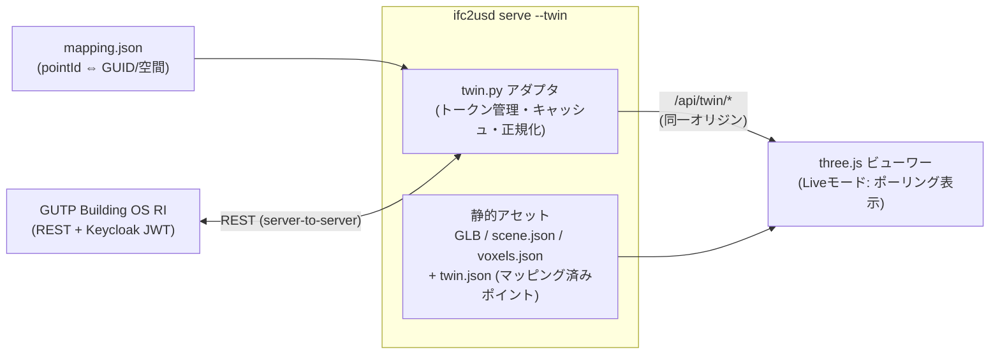

# デジタルツイン表示モード仕様（Epic E9）

GUTPビルOSリファレンス実装（[gutp-bim/gutp-building-os-ri](https://github.com/gutp-bim/gutp-building-os-ri)）
等の建物データプラットフォームからセンサ・設備の実測値を取得し、変換済みUSDのBIM要素・
ボクセルへマッピングしてWebビューワー上に表示する「ツインモード」の仕様。
実装単位は `docs/viewer/backlog.md` の Epic E9 に対応する。

## 1. 目的

- 選択したBIM要素の**いまの値**（温度・CO₂・電力・在室など）をビューワーで確認できる。
- メトリックを選ぶと、対応する要素・空間ボクセルが**値に応じた色**（ヒートマップ）になる。
- 過去データの**時系列再生**で「昨日の午後の温度分布」のような問いに答えられる。
- 既存ビューワーの静的機能は一切壊さない。ツインデータが無ければ従来通り動く
  （voxels.json / sdf.json と同じ「付加的アセット」の設計原則）。

## 2. 対象プラットフォーム: GUTPビルOS RI 調査結果（2026-07時点）

一次ソース（リポジトリの`docs/`配下、raw.githubusercontent.com経由で取得）を確認済み。

### 確認できた事実

- **本体**: .NET 8 / ASP.NET Core + Next.js + NATS JetStream + OxiGraph（RDF/SPARQL）+
  TimescaleDB。Docker Composeで起動。Apache-2.0。認証はKeycloak OIDC（JWT Bearer、
  開発用に`DISABLE_AUTH=true`あり）。
- **REST API**（`docs/api-client-guide.md`）:
  - 階層走査: `GET /api/buildings` → `/api/floors?buildingDtId=` → `/api/spaces?floorDtId=`
    → `/api/devices?spaceDtId=` → `/api/points?deviceDtId=`
  - 最新値: `GET /telemetries/query?pointId=<id>&latest=true`
    → `{"pointId", "value", "datetime", "unit"}`
  - 期間指定: `GET /telemetries/query?pointId=<id>&start=…&end=…&granularity=None|Hour|Day`
    → `[{datetime, value}, …]`
  - 検索: `GET /resources/search?q=` / `?customTags=`
- **クライアント向けのプッシュ（WebSocket/SSE）は文書化されていない** → ライブ更新は
  ポーリング前提で設計する。
- **データモデルはSBCOオントロジー**（`sbco:Building → Level → Room → EquipmentExt →
  PointExt`）のRDFグラフで、識別子はDtId（URI）。
- **最重要**: ライブのデータモデルに**IFC GlobalId/GUIDも空間座標も存在しない**
  （`resource-management.md`/`oss-sparql-mapping.md`で明記）。`standard-mapping.md`に
  `sbco:Room↔IfcSpace`・`device_id↔IfcGUID(部分一致)`等の対応表があるが、
  「専門家レビュー待ちの不完全な参考表」と明示されており、機械可読なリンクは無い。
  **→ GUID結合はビルOS側から得られない。本仕様が自前のマッピング層を定義する。**

### 未確認・要注意

- CORS設定（`CORS_ALLOWED_ORIGINS`環境変数）はREADME要約からの情報で、原典未確認。
  ブラウザからの直接fetchは当てにせず、**サーバー側プロキシを基本設計**とする。
- 実インスタンスの利用可否（E9-1のPoCで確定させる。無ければモックで進める）。
- 実データに`sbco:Room`ノードが無い（機器がフロア名文字列で紐づく）構成もあり得る。

## 3. 全体アーキテクチャ



設計判断:

1. **プロキシ経由を基本とする。** 理由: (a) CORSが未確認、(b) KeycloakのJWT/クレデンシャルを
   ブラウザへ出さない、(c) 複数タブ/クライアントがいても上流へのリクエストをサーバー側
   キャッシュ（TTL=ポーリング間隔）で1本化できる。`make_server`は現在も127.0.0.1バインドで、
   プロキシも同じ制約下に置く（LAN公開はスコープ外）。
2. **読み取り専用。** ビルOSの制御API（`POST /api/points/<id>/control`）はプロキシで
   一切中継しない（ホワイトリスト方式で最新値/期間クエリ/リソース一覧のみ許可）。
3. **ポーリング。** 既定10秒間隔。プッシュAPIが将来文書化されたら差し替えられるよう、
   ビューワー側は「値の束が届いたら差分適用する」1つの入口関数に集約する。

## 4. データモデル

### 4.1 mapping.json（ポイント⇔BIMの対応表）— 本仕様の中核

ビルOS側にGUIDが無い以上、対応表はこのリポジトリの管理物になる。スキーマ:

```jsonc
{
  "version": 1,
  "source": { "buildingOs": "http://localhost:5000", "buildingDtId": "..." },
  "bindings": [
    {
      "pointId": "point-123",              // ビルOS側の識別子
      "metric": "temperature",             // 正規化メトリック名（§6.2の凡例単位はここに紐づく）
      "target": { "guid": "2AeZbGoSL7..." }  // BIM要素へ直接紐づけ
    },
    {
      "pointId": "point-456",
      "metric": "co2",
      "target": { "spaceGuid": "1xYz..." }   // IfcSpace（空間）へ紐づけ → E9-5の集計単位
    }
  ],
  "unmapped": ["point-789"]                 // 生成時に解決できなかったポイント（警告として保持）
}
```

生成経路は3つ（併用可、優先度順にマージ）:

1. **手動記述**（常に使える正攻法）: 上記JSONを人が書く。小規模・PoCはこれで開始する。
2. **IFCプロパティ由来**（半自動）: IFCのPset（例: 設備タグ、機器番号）と、ビルOS側の
   `sbco:id`/`device_id`/ポイント名の**文字列規約一致**で候補を生成する。
   `get_properties()`（`ifc.py`）が既にPsetを平坦化できるため、突合スクリプトは
   「両方の識別子リストを読み、正規化（大小文字・記号）して一致・曖昧一致を提案する」
   ジェネレータとして実装する。曖昧一致は自動採用せず、人の確認用に提案リストを出す。
3. **ビルOS側`customTags`運用**（インスタンスを自分たちで運用できる場合のみ）:
   ビルOSのリソースに`customTags`としてIFC GUIDを登録し、`/resources/search?customTags=`
   で逆引きする。最も堅牢だが、ビルOS側データの管理権限が前提。

### 4.2 twin.json（serveが焼き込む静的マニフェスト）

`build_serve_directory(..., twin=...)`が生成し、`scene.json`の`assets.twin`から参照する
（voxels.json/sdf.jsonと同じ規約）。内容: メトリック一覧（名前・単位・凡例のmin/max・
カラーマップ名）、GUID⇔pointIdの結合済みマッピング、ポーリング間隔、stale閾値。
**値そのものは含めない**（値は§4.3のライブAPIから取る。twin.jsonは「構造」だけ）。

### 4.3 ライブAPI（serveのプロキシエンドポイント）

| エンドポイント | 上流 | 内容 |
| --- | --- | --- |
| `GET /api/twin/values?metric=<m>` | `/telemetries/query?latest=true`（ポイント数ぶん、キャッシュ付き） | そのメトリックの全マッピング済みポイントの最新値の束 `[{pointId, guid?, spaceGuid?, value, unit, datetime}]` |
| `GET /api/twin/history?pointId=&start=&end=&granularity=` | 同名のビルOS API | 時系列再生・スパークライン用 |

キャッシュ: メトリックごとにTTL（=ポーリング間隔）。TTL内の再要求は上流へ行かない。
上流エラー時は最後の成功値+`stale: true`を返し、ビューワーは灰色表示に切り替える。

## 5. ビューワー表示仕様

### 5.1 Liveモード UI

ツールバーに「Live」グループ（E8-5のグループ化に従う）を追加:
メトリック選択（`twin.json`のメトリック一覧）、ON/OFFトグル、一時停止、凡例表示。
`scene.json`に`assets.twin`が無ければグループ自体を出さない（SDFスライスと同じ規約）。

### 5.2 オブジェクトの値色マッピング（E9-4）

- **カラーマップ**: 256エントリの事前計算LUT（turbo系）。値→`clamp((v-min)/(max-min))`→
  LUT参照。min/maxは`twin.json`のメトリック定義から（未指定なら受信値のP5〜P95で自動）。
- **適用先**: 対象GUIDのメッシュのマテリアル色を上書き（E8-1で確定する
  クローン戦略に従い、共有マテリアルへの波及を防ぐ）。復元用に元色を保持。
  選択ハイライト（emissive/アウトライン）とは独立に共存する。
- **stale表示**: `datetime`がポーリング間隔×3より古い値は彩度を落とした灰色にする。
  「動いているように見えて実は止まっている」ダッシュボードの典型事故を防ぐための必須要件。
- **凡例**: 画面隅にグラデーションバー+min/max+単位。カラーマップとの同期はLUTを共有。

### 5.3 プロパティパネル Live Dataセクション（E9-4）

要素選択時、その要素に紐づくポイントの一覧（メトリック名・最新値・単位・取得時刻）を表示。
各行にcanvas直描きのスパークライン（直近1時間、`/api/twin/history`から取得、外部チャート
ライブラリは導入しない）。

### 5.4 空間/ボクセルヒートマップ（E9-5 = E5-4の実現）

部屋（IfcSpace）単位の集計値を、その空間を満たすボクセルの色で表示する。

- **前提の欠落に注意**: 現行の`ifc.py`の`get_geometry()`は**IfcSpaceのジオメトリを
  スキップしている**（opening/space/zone除外）。空間ボクセルを得るには、空間だけを
  対象にした抽出経路（`get_space_geometry()`等）の追加が必要。これはE9-5内の
  先行タスクとして扱う。
- **アルゴリズム**:
  1. 各IfcSpaceのメッシュを`voxelize_mesh(..., fill=True)`で充填ボクセル化
     （シーン共有origin・LODサイズはvoxels.jsonと同一規約）
  2. ボクセル→spaceGuidの対応表を作る（重複セルは体積の小さい空間を優先）
  3. mapping.jsonの`spaceGuid`バインディングで、空間ごとの値を集計
     （既定は平均。min/max/countも選択可）
  4. 空間の充填ボクセルを集計値の色でInstancedMesh描画（既存のボクセル描画・
     LOD切替・Issue #39修正後の描画品質に乗る）
- 空間ジオメトリが取れないモデル（IfcSpace未定義）では、フロア（Storey）単位の
  フォールバック集計を提供する（ツリー階層は`scene.json`に既にある）。

### 5.5 時系列再生（E9-6）

期間+粒度を指定して`/api/twin/history`を全対象ポイントぶん取得し、
`Float32Array`のフレーム列（時刻×ポイント）へ整形してからスライダーで再生する
（再生中の逐次fetchはしない）。スライダー操作は§5.2と同じ色適用関数を呼ぶだけにし、
ライブ/再生で表示経路を分岐させない。

## 6. 非機能要件

- **オフライン劣化**: `assets.twin`が無い/プロキシが落ちている場合も、既存機能は
  完全に動作する。ライブ取得失敗はUI上のstale表示+コンソールwarnに留める。
- **秘匿情報**: ビルOSのURL・クレデンシャルはserve起動時の設定ファイル
  （`--twin twin-config.json`）のみに存在し、ブラウザへ送る`twin.json`には含めない。
- **性能**: 値の束の差分適用はO(変化したポイント数)。ポイント数の想定上限は
  数千（1建物）。ヒートマップの色更新は`instanceColor.needsUpdate`1回に集約。
- **テスト**: ビルOSの実インスタンスに依存しない。§2の文書化済みペイロード形を返す
  **モックHTTPサーバーをpytestフィクスチャとして実装**し、アダプタ・プロキシ・
  ビューワーE2E（Playwright）をモックに対して回す。実インスタンス接続はE9-1のPoCで
  手動確認し、チェックリスト化する（E4-1/E4-2の前例に従う）。

## 7. 段階導入（バックログ対応）

| フェーズ | ストーリー | 成果 |
| --- | --- | --- |
| 1 | E9-1 | モック+（可能なら）実インスタンスへの接続PoC、`twin.json`/プロキシAPIスキーマ確定 |
| 2 | E9-2 | mapping.jsonの3経路ジェネレータ+未マッピング警告 |
| 3 | E9-3 | `serve --twin`: プロキシ+twin.json焼き込み |
| 4 | E9-4 | 要素色マッピング+凡例+Live Dataパネル（最初に目に見える価値） |
| 5 | E9-5 | 空間ボクセルヒートマップ（E5-4/Issue #30をクローズ） |
| 6 | E9-6 | 時系列再生 |

依存: E9-4/E9-5の視覚品質はE8-6（Issue #39修正）とE8-1（マテリアルクローン戦略）に
依存する。Epic E8を先行させること。

## 8. 未解決事項（実装開始時に確定させる）

1. 接続先の実インスタンス有無（無ければ`docker-compose.oss.yaml`をローカル起動 or モックのみ）。
2. CORS/認証の実挙動（E9-1で確認。直接fetchが可能でもプロキシ設計は維持し、
   直接fetchは将来の最適化オプションとする）。
3. マッピング規約（Pset名・機器番号の命名規則）は対象建物のデータ次第。
   ToyodaLab.ifcにはセンサ機器のPsetが無い可能性が高く、その場合はデモ用の
   合成mapping.json+モック値で機能を成立させる。
4. `sbco:Room`が実データに無い場合のフロア単位フォールバックの扱い。
